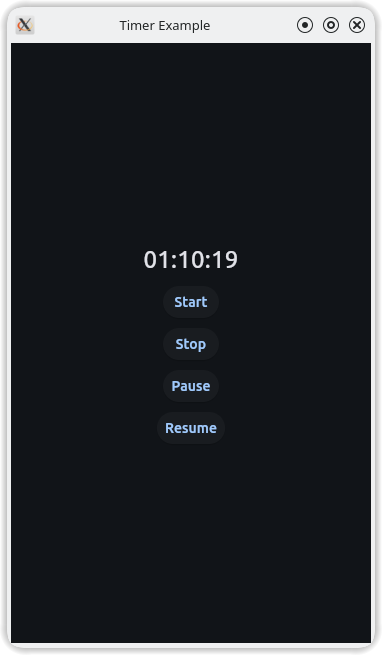

# Flet Timer v1.0.2
 
The `Timer` is a timer class
It demonstrates how to create a countdown timer using threading for real-time display updates.

## Features

- Countdown Timer: Implements a dynamic countdown.
- Real-Time Updates: Displays updates in real time.
- Threading: Uses threading for non-blocking execution.

## Installation
You can install Flet Timer using pip:

```bash
pip install git+https://github.com/omamkaz/flet-timer.git
```

## Usage

Here's an example that demonstrates how to use the `Timer` and `debounce`.

### debounce
```python
from flet_timer import debounce


@debounce(0.3)
def func(*args, **kwargs) -> None:
    print("Hi...")
```

### Timer
```python
import flet as ft
from flet_timer import Timer
from datetime import datetime


def main(page: ft.Page):
    page.title = "Timer Example 1"
    page.vertical_alignment = ft.MainAxisAlignment.CENTER
    page.horizontal_alignment = ft.CrossAxisAlignment.CENTER

    page.window.width = 360
    page.window.height = 600


    def update_time():
        timer_txt.value = datetime.now().strftime("%H:%M:%S")
        page.update()


    timer = Timer(callback=update_time)

    timer_txt = ft.Text(
        value=datetime.now().strftime("%H:%M:%S"), 
        text_align="center",
        size=24
    )

    page.add(
        timer_txt,
        ft.Button(
            text = "Start",
            on_click=lambda e: timer.start()
        ),
        ft.Button(
            text = "Stop",
            on_click=lambda e: timer.stop()
        ),
        ft.Button(
            text = "Pause",
            on_click=lambda e: timer.pause()
        ),
        ft.Button(
            text = "Resume",
            on_click=lambda e: timer.resume()
        )
    )

ft.app(target=main)
```

## Output of above code


